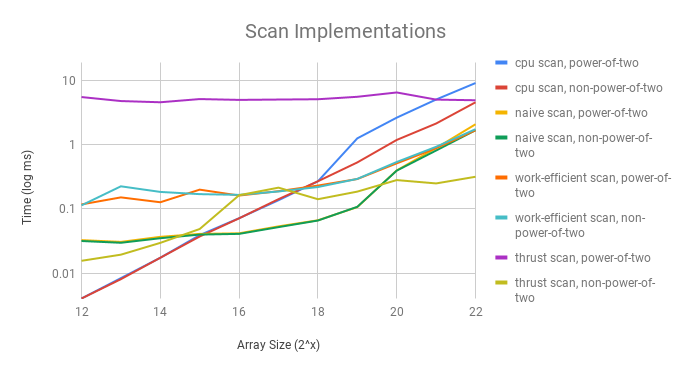

CUDA Stream Compaction
======================

**University of Pennsylvania, CIS 565: GPU Programming and Architecture, Project 2**

* Alexander Chan
* Tested on: Windows 10 Version 1803, i7-5820k @ 3.70 GHz 16GB, GTX 1080 @ 1620 MHz 8GB (Personal Computer)

### README

* Implemented CPU scan
* Implemented naive and work efficient scan
* Implemented stream compaction using work efficient scan

## Performance Analysis
Here are metrics for scan, including CPU, naive, work efficient, and thrust.



The horizontal axis indicates the array size, doubling with every tick. Thus, to visualize a better relationship, the vertical axis is a log scale.

As we can see, the CPU scan is almost a perfect linear relationship between array size and time. This makes sense as there are O(N) operations in scan. For smaller array sizes,
the CPU scan is faster than all GPU implementations. This is likely due to constant overhead of kernel invocations, and the fact that the GPU implementation only uses slow global memory, while the CPU was able to take advantage of its cache, which excelled in the sequential lookups and writes of small elements in the scan algorithm. The work efficient implementations are slower than the naive implementations, probably because there are twice as many kernel invocations, in addition to using more global memory. Thrust's implementation is slower, but constant. This probably means that Thrust is doing other work in addition to performing the scan.

Here are metrics for stream compaction. Once again, the horizontal axis indicates the array size, doubling with every tick, and the vertical axis is a log scale.


## Output

```
****************
** SCAN TESTS **
****************
    [  38   4  37  27  41  44  46   5   2   8  23   9  12 ...  13   0 ]
cpu scan, power-of-two
0.032968
    [   0  38  42  79 106 147 191 237 242 244 252 275 284 ... 399406 399419 ]
cpu scan, non-power-of-two
0.03359
    [   0  38  42  79 106 147 191 237 242 244 252 275 284 ... 399313 399349 ]
    passed
naive scan, power-of-two
0.041984
    passed
naive scan, non-power-of-two
0.04096
    passed
work-efficient scan, power-of-two
0.136192
    passed
work-efficient scan, non-power-of-two
0.136192
    a[8384] = 203041, b[8384] = 602399
    FAIL VALUE
thrust scan, power-of-two
4.56704
    passed
thrust scan, non-power-of-two
0.048096
    passed

*****************************
** STREAM COMPACTION TESTS **
*****************************
    [   2   0   1   0   0   1   0   2   1   2   3   1   1 ...   1   0 ]
cpu compact without scan, power-of-two
0.039811
    [   2   1   1   2   1   2   3   1   1   1   2   1   3 ...   2   1 ]
    passed
cpu compact without scan, non-power-of-two
0.038878
    [   2   1   1   2   1   2   3   1   1   1   2   1   3 ...   1   2 ]
    passed
cpu compact with scan
4.0355
    [   2   1   1   2   1   2   3   1   1   1   2   1   3 ...   2   1 ]
    passed
work-efficient compact, power-of-two
3.71302
    [   2   1   1   2   1   2   3   1   1   1   2   1   3 ...   2   1 ]
    passed
work-efficient compact, non-power-of-two
4.68685
    [   2   1   1   2   1   2   3   1   1   1   2   1   3 ...   1   2 ]
    passed
```